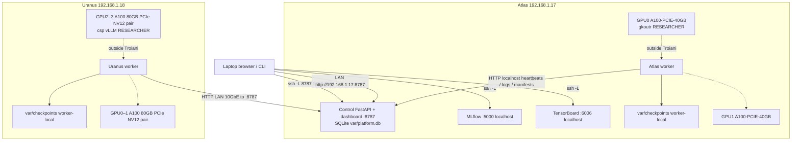

# Architecture (this lab)

Render the figure with:

```bash
pip install -e ".[docs]"   # diagrams + graphviz
python docs/architecture.py            # readable Graphviz boxes (committed)
python docs/architecture.py --icons    # mingrammer/diagrams icons
```

Output: [`architecture.png`](architecture.png).



Honest constraints:

- Checkpoints stay on the node that wrote them (`var/checkpoints`). Atlas stores **manifests** in SQLite, not the weight files. Atlas-as-store is not implemented. There is no shared filesystem on this diagram.
- Placement is **same-node** only. A “2-node smoke” is two independent jobs. No NCCL across Atlas and Uranus (two chassis; 10GbE only).
- Researchers on GPUs are outside the platform. Never kill those PIDs.
- MLflow and TensorBoard bind loopback on Atlas; the dashboard binds `0.0.0.0:8787`.
